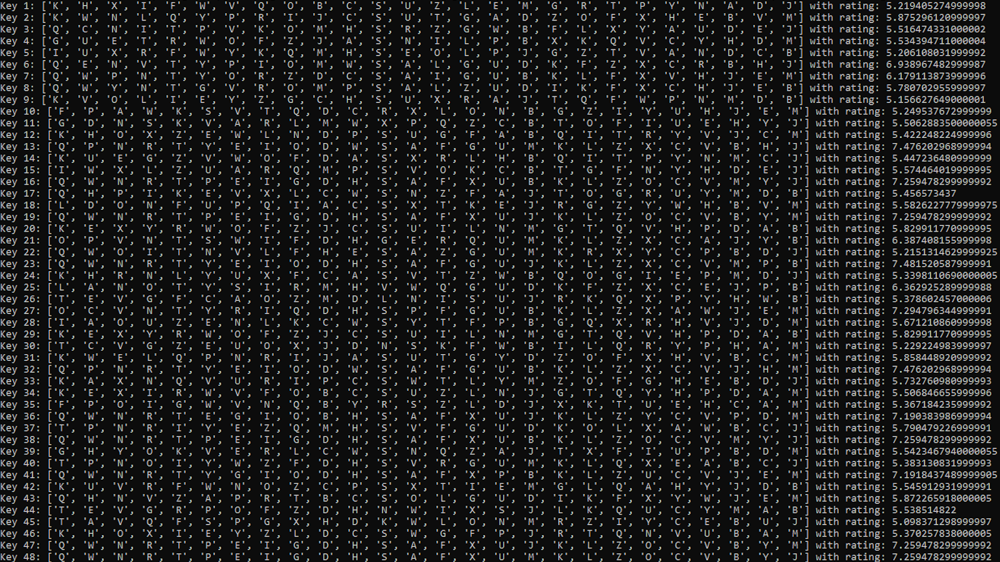

# Simple Substitution Cipher Tool

A Python-based cryptanalysis project that encrypts, decrypts, and automatically breaks simple substitution ciphers.



## Overview

This project implements a simple substitution cipher tool that can encrypt and decrypt text with a known key and crack ciphertext without a key using a hill-climbing algorithm.

It demonstrates how an understanding of classic cryptanalysis techniques, combined with statistical language modeling, can efficiently recover plaintext from encrypted messages.

## Tech

This project demonstrates:

* Cryptography
* Algorithms
* Python

## How It Works

### Substitution Cipher:

A substitution cipher replaces each letter with another based on a fixed permutation of the alphabet.

Example:
Key = QWERTYUIOPASDFGHJKLZXCVBNM

```
A -> Q
B -> W
C -> E
etc.
```

Encryption and decryption functions apply this mapping to transform text.

### Cracking the Cipher (Hill-Climbing Algorithm)

Search for a key that produces the most "English-like" output:

* Generate a random key.
* Decrypt the ciphertext with that key.
* Score the result based on common English letter patterns.
* Randomly swap two letters in the key.
* Keep the mutation only if it improves the score.
* Repeat until no improvements occur.
* Optionally restart with a new random key.
* Return the best result found overall.

This logic was particularly interesting to design and optimize.

## How to Run

### Run:
```bash
python SimpleSubstitution.py
```

### Provide Encrypted String:

Here's one that I used to test the project. The more letters it has, the easier it'll be for the program to crack the key:

fg zit pgxkftn rgtlfz tfr itkt rtqzi ol pxlz qfgzitk hqzi gft ziqz vt qss dxlz zqat zit uktn kqofexkzqof gy ziol vgksr kgssl wqea qfr qss zxkfl zg losctk usqll qfr zitf ngx ltt oz viozt ligktl qfr wtngfr q yqk ukttf egxfzkn xfrtk q lvoyz lxfkolt

Key: QWERTYUIOPASDFGHJKLZXCVBNM

## Highlights

### Scoring Function
Uses bi-gram and tri-gram frequency data to evaluate how closely the text resembles English.

```py
def rate(text):
    rating = 0

    if FILTER_MONO_GRAPHS:
        for i in range(1, len(text)):
            bigraph = text[i].upper()
            if bigraph in bratings:
                rating += bratings[bigraph]
    for i in range(2, len(text)):
        bigraph = text[i - 2:i].upper()
        if bigraph in bratings:
            rating += bratings[bigraph]
    for i in range(3, len(text)):
        trigraph = text[i - 3:i].upper()
        if trigraph in tratings:
            rating += tratings[trigraph]

    return rating
```

## What I Learned
* How classical ciphers can be broken using frequency analysis.
* Importance of balancing accuracy and performance.
* How weighted data can guide complex decisions.

## What I Would Improve

If I were to remake this project today, I would:
* Preservation logic to keep track of spaces between words from input strings and reconstruct the output with spaces.
* Add user validation logic that allows the user to quickly get rid of the top key and restart the algorithm.
	* This could also lead to making logic that updates the pattern rating weights, which in turn would make the algorithm run better.
* Implement a clearer visual interface via a web application.
* Multithreading to run multiple hill climbs simultaneously and improve performance.
